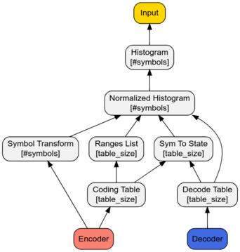

# EntropyEncoding Experiments

This repository contains my Entropy Encoding notebook. Entropy encoding is an
efficient lossless data compression scheme.

Huffman coding is a well known technique that uses a path in a binary decision
tree to represent a symbol in some alphabet. Symbols are encoded using a
sequence of complete bits, because the path in the binary tree is made of
decisions to go left or right.

According to information theory the optimal cost in bits for some symbol is
"-log2(P(sym))", which is usually not a round number. For a symbol probability
of 33%, we get -log2(1/3) = 1.58 bits, but in Huffman encoding we would need to
send two bits. Huffman encoding is optimal if all of the symbol frequencies are
a power of two, but this is not the typical case. Arithmetic coding allows us to
save fractional bits of information and get close to Shannon's limit.

This is a simple example of an Arithmetic Encoder that can handle
non-power-of-two probabilities for an alphabet of 3 characters, with equal
symbol frequencies. This example uses a state variable to combine bits from
different symbols to overcome the two bits per symbol barrier.

```rust
fn encode(state : &mut u64, sym : u64) {
    *state *= 3;
    *state += sym;
}

fn decode(state : &mut u64) -> u64 {
    let sym = *state % 3;
    *state /= 3;
    sym
}

#[test]
fn test_encode_base3() {
    let mut state = 0;
    encode(&mut state, 2);
    encode(&mut state, 1);
    encode(&mut state, 0);

    assert_eq!(decode(&mut state), 0);
    assert_eq!(decode(&mut state), 1);
    assert_eq!(decode(&mut state), 2);
}
```

Asymmetric numeral systems (ANS) is a relatively new approach that generalizes
the example above. ANS uses a state machine to represent bit fractions, and uses
an implementation that does not require expensive arithmetic operations.

I spent some  time reading about asymmetric numeral systems
(ANS) and wrote some code to help me learn the topic. In this repository I
implemented two varients of the tANS encoder.  The first implementation is a
very simple encoder, and the second implementation is a simplified version of
the efficient implementation by Yann Collet:
[FSE](https://vscode.dev/github/Cyan4973/FiniteStateEntropy).

The code is structured like a research notebook with unit tests that drive the
code. The two interesting files are simple.rs and fse.rs. The Simple file
implements a basic encoder that is not very memory efficient. The FSE file
implements a subset of the the advanced FSE encoder that Yann wrote. This
encoder has many optimizations that makes the C code more difficult to follow. I
tried to remove some of the optimizations to make the code more readable, and I
also attached a diagram that explains the flow of information within the encoder
(below).


This unit test is a good starting point for exploring the implementation of the
encoder.

```rust 
#[test]
fn test_round_trip_simple_encoder() {
    let text =  "entropy encoding is typically the last stage of a compression algorithm";
    let input: Vec<u8> = text.as_bytes().to_vec();

    // Define an encoder with 8bit symbols, and 12bit states.
    let mut enc = Simple::<256, 4096>::new();
    // Initialize the encoder based on the statistical properties of the input.
    enc.from_data(&input);
    // Encode the test.
    enc.encode_data(&input);
    // Print the compressed binary representation.
    enc.bitvector.dump();
    // Decode the data.
    let out = enc.decode_data();

    println!("Decoded {:?}", out);
    println!("Input length = {}", 8 * input.len());
    println!("Compressed length = {}", enc.bitvector.len());
    assert_eq!(out, input);
}


```

Program output: 
```shell 
running 1 test
[00000001111001111101010000110101
.10010110000100101010001000110110
.11011001000101000101110010000011
....
.11001100110]
Decoded [101, 110, 116, 114, 111, 112, 121, 32, 101, 110,  .... ]
Input length = 568
Compressed length = 427
test simple::test_round_trip_simple_encoder ... ok

```

Here are a few useful links that I used while learning the topic:
* Yann's Blog post describing FSE: [Link](http://fastcompression.blogspot.com/2013/12/finite-state-entropy-new-breed-of.html)
* Python notebook that implements FSE: [Link](https://github.com/GarethCa/Py-tANS/blob/master/Py-tANS.ipynb)
* Excellent blog post that explains the encoding technique: [Link](http://www.ezcodesample.com/abs/abs_article.html).
* Blog posts by Charles Bloom: [Link](http://cbloomrants.blogspot.com/2014/02/02-18-14-understanding-ans-conclusion.html).
* Academic paper by Jarek Duda that: [Link](https://arxiv.org/abs/1311.2540)


This char shows the flow of information in the FSE encoder:



